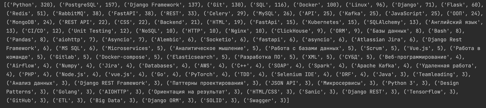
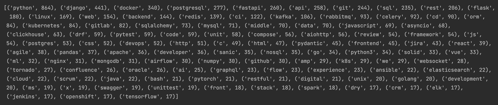

# hh-api-skills-analyst

**hh-api-skills-analyst** – собирает ключевые слова из 
вакансий на HeadHuner, подсчитывает их частность и выдает 2 списка:
- **Топ 100 навыков**, которые рекрутеры указывают в вакансиях. 
Их можно использоваться для SEO оптимизации своего резюме. 
Добавив навыки из топа в свое резюме оно будет выше в выдаче, 
вы получите больше просмотров и приглашений

- **Топ 100 ключевых слов**, которые берутся из тела вакансии. 
Получается выборка более релевантных требований, которые на самом 
деле сейчас актуальны на рынке. Эти данные можно использовать 
например для планирования своей учебы. Их также желательно 
добавить в свое резюме, например для описания обязанностей на предыдущем месте работы.


Этот скрипт используется на сайте [easyoffer.ru](https:/easyoffer.ru) в разделе Требования


## Установка
Создайте и запустите виртуальное окружение
```
python -m venv venv
source venv/bin/activate
```
Загрузите зависимости
```
pip install -r requirements.txt
```
Зарегистрируйте приложение на [HeadHunter](https://dev.hh.ru/?utm_source=hh.ru&utm_medium=referral&utm_campaign=from_footer_new).

Добавьте в файл `conf.py` данные о своем приложении
